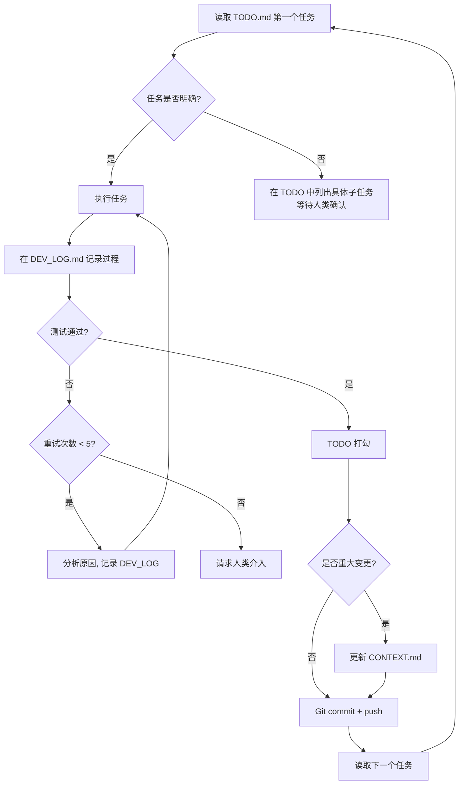

# PCR_GBA_Tool - 项目技术文档

## 📋 项目概述

**PCR_GBA_Tool** 是一个基于 ADB 的 Princess Connect! Re:Dive 公会战（Guild Battle）自动化工具。通过图像识别和 UI 自动化控制 Android 模拟器/设备，实现公会战自动挑战。

- **核心技术**: ADB + 图像识别（颜色匹配 / 模板匹配）+ UI 导航自动化
- **语言**: Python 3.8+
- **目标平台**: Android 模拟器（MuMu12 / 其他 ADB 支持的模拟器）
- **架构灵感**: AzurLaneAutoScript

---

## 🏗️ 分层架构

```
Config Layer（配置层）
    ↓
Device Layer（设备层：ADB 连接 / 截图 / 控制）
    ↓
Base Layer（基础层：ModuleBase / Button / Template / Timer）
    ↓
UI Layer（UI 层：页面导航 / 滚动）
    ↓
Handler Layer（Handler 层：业务逻辑 - 登录 / 战斗等）
    ↓
Scheduler（调度层：pcr.py - 任务编排）
```

**严格规则：只能向下依赖，禁止跨层调用（如 Handler 直接用 Connection）。**

---

## 📁 完整目录结构

```
PCR_GBA_Tool/
├── CLAUDE.md                      # Claude Code 开发指引
├── CONTEXT.md                     # 本文件：AI 工作上下文
├── SKILL.md                       # AI 工作流提醒
├── TODO.md                        # 任务队列
├── DEV_LOG.md                     # 开发日志
├── README.md                      # 项目说明
├── pcr.py                         # 主入口：PCRGBATool 调度类
├── requirements.txt               # 依赖声明
│
├── assets/                        # 图像识别资源（PNG）
│   ├── character/                 # 角色相关（模板匹配用）
│   ├── handler/                   # 通用弹窗按钮
│   ├── mask/                      # 图像遮罩
│   ├── train/                     # 训练场按钮
│   └── ui/                        # UI 导航按钮
│
├── bin/                           # 二进制依赖
│   ├── DroidCast/                 # 截图 APK
│   ├── MaaTouch/                  # 触控工具
│   └── cnocr_models/pcr/          # OCR 模型
│
├── config/                        # 配置文件（JSON）
│   ├── maple.json                 # 实际使用配置
│   └── template.json              # 配置模板
│
├── dev_tools/                     # 开发工具
│   ├── create_button.py           # Button 创建工具（必用）
│   ├── button_extract.py          # 从已有资源提取 Button 定义
│   ├── button_creator.html        # 浏览器可视化选区工具
│   └── droidcast_raw.py           # DroidCast 调试
│
├── doc/                           # 开发文档（详细参考）
│   ├── 1 setup.md                 # 环境搭建
│   ├── 2.1 architecture.md        # 架构详解
│   ├── 2.2 config.md              # 配置系统
│   ├── 3.1 image_recognition.md   # 图像识别系统（重要）
│   ├── 3.2 ui_navigation.md       # UI 导航系统
│   ├── 4.1 logger.md              # 日志系统
│   ├── 4.2 exception.md           # 异常系统
│   └── FAQ.md                     # 常见问题
│
├── module/                        # 核心源代码
│   ├── exception.py               # 全局异常定义
│   ├── logger.py                  # 日志模块（基于 rich）
│   ├── base/                      # 基础层
│   ├── character/                 # 角色模块
│   ├── config/                    # 配置层
│   ├── device/                    # 设备层
│   ├── handler/                   # Handler 层
│   ├── ocr/                       # OCR 识别
│   ├── train/                     # 训练场模块
│   └── ui/                        # UI 导航层
│
├── static/                        # Web 静态资源
├── tests/                         # 测试脚本（直接运行，非 pytest）
└── logs/                          # 运行日志（按日期）
```

---

## 🔑 关键模块详解

### pcr.py — 调度器

```python
class PCRGBATool(LoginHandler):
    def __init__(config_name="maple")
    config          # @cached_property -> PriconneConfig
    device          # @cached_property -> Device

    def run(command)   # 任务执行+异常捕获中心
    def loop()         # 主循环
    def start()        # 调用 LoginHandler.app_start()
    def restart()      # 调用 LoginHandler.app_restart()
```

**异常处理逻辑（在 run() 中）**:
- `GameStuckError` / `GameNotRunningError` / `GameTooManyClickError` → 返回 False，等待重试
- `RequestHumanTakeover` → `sys.exit(1)` 退出
- 未捕获异常 → 也会导致退出

---

### module/base/base.py — ModuleBase（核心基类）

所有模块的基类，核心方法：

```python
# 检测按钮是否出现（颜色匹配或模板匹配）
appear(button, offset=0, interval=0, similarity=0.85, threshold=10)
# offset=0: 颜色匹配（快速）
# offset>0: 模板匹配（精确，支持位移）

# 出现则点击
appear_then_click(button, ...)

# 等待出现（阻塞）
wait_until_appear(button, skip_first_screenshot=False)

# 等待消失（阻塞）
wait_until_disappear(button)

# 裁剪截图区域
image_crop(button)
```

**重要**: 所有 `appear()` 调用前必须先执行 `self.device.screenshot()`。

---

### module/base/button.py — Button / ButtonGrid

```python
# Button 定义格式
BUTTON_NAME = Button(
    area=(x1, y1, x2, y2),      # 检测区域
    color=(r, g, b),              # 颜色匹配期望值
    button=(x1, y1, x2, y2),     # 点击区域（可与 area 不同）
    file='./assets/xxx/NAME.png', # 模板图片路径（相对于项目根）
    name='BUTTON_NAME'            # 按钮名称
)

# ButtonGrid 用于规则排列的按钮组
grid = ButtonGrid(
    origin=(x, y),           # 左上角第一个按钮的位置
    delta=(dx, dy),           # 按钮间距
    button_shape=(w, h),      # 单个按钮大小
    grid_shape=(cols, rows)   # 格子数量
)
grid[(col, row)]  # 获取指定位置的 Button
```

**创建 Button 必须使用 `python dev_tools/create_button.py`，不要手动计算坐标。**

---

### module/base/template.py — Template（全屏搜索）

用于位置不固定的元素：

```python
TEMPLATE = Template('./assets/xxx/ICON.png')
result = TEMPLATE.match_result(image)  # 返回 (相似度, Button位置)
buttons = TEMPLATE.match_multi(image)  # 返回所有匹配位置列表
```

---

### module/base/timer.py — Timer

```python
timer = Timer(limit=3.0, count=5)  # 3秒或5次，两个条件都要满足
timer.start()
if timer.reached():               # 判断是否超时
    ...
timer.reset()                     # 重置
timer.reached_and_reset()         # 用于节流
```

---

### module/device/ — 设备层

**继承链（MRO）**:
```
Device -> Control -> MaaTouch -> DroidCast -> Adb -> Connection
```

关键方法：
```python
device.screenshot()                   # 截图（根据配置自动选择方法）
device.click(button)                  # 点击（根据配置自动选择方法）
device.swipe(p1, p2, duration)        # 滑动
device.app_start() / app_stop()       # 应用生命周期
device.stuck_record_check()           # 卡死检测（60s/300s 阈值）
device.click_record_check()           # 死循环点击检测（12次阈值）
```

**截图方法**（由 config.Emulator_ScreenshotMethod 决定）：
- `ADB`: 通用，较慢
- `DroidCast_raw`: 快速，需安装 APK
- `NemuIpc`: MuMu12 专用极速

**触控方法**（由 config.Emulator_ControlMethod 决定）：
- `ADB`: 通用
- `MaaTouch`: 快速，支持更复杂手势

---

### module/ui/ — UI 导航层

```python
# 已定义页面节点
page_main         # 主界面
page_adventure    # 冒险
page_team_battle  # 公会战
page_train        # 训练场
page_menu         # 菜单
page_unknown      # 未知页面

# 导航方法
ui_goto(page_train)           # 导航到指定页面（自动路径规划）
ui_ensure(page_main)          # 确保在指定页面
ui_get_current_page()         # 识别当前页面
ui_click(click_btn, check_btn)  # 点击并等待确认
```

**导航图**:
```
page_main <-> page_adventure -> page_team_battle
page_main <-> page_menu -> page_train
```

---

### module/handler/ — Handler 层

**现有 Handler**:

| Handler | 文件 | 功能 |
|---------|------|------|
| `LoginHandler(UI)` | `login.py` | 启动/停止/重启应用，处理登录流程（公告、确认、主界面） |

**新建 Handler 规范**:
```python
# 必须继承自 UI
class NewHandler(UI):
    def some_task(self):
        self.device.screenshot()
        if self.appear(SOME_BUTTON):
            self.device.click(SOME_BUTTON)
```

**assets.py 中已有的 Button**:
- `ANNOUNCE_CLOSE`: 关闭公告
- `COMFIRE`: 确认
- `LOGIN_CHECK`: 登录确认
- `前往商店`, `取消`

---

### module/train/ — 训练场模块

| 类 | 文件 | 功能 |
|----|------|------|
| `TrainCombat` | `combat.py` | 训练场战斗控制（检测战斗状态、开始战斗、等待加载） |
| `CharacterSelector` | `character_selector.py` | 自动选择角色（清空选择、滚动列表、识别角色模板匹配） |

---

### module/config/ — 配置层

**配置访问模式** (属性名 = `{Group}_{Argument}`):
```python
config = PriconneConfig("maple")  # 加载 config/maple.json
config.Emulator_ScreenshotMethod  # -> "DroidCast_raw" 等
config.Emulator_ControlMethod     # -> "MaaTouch" 等
config.Emulator_Serial            # -> "auto" 或具体地址
```

**配置热更新**: `ConfigWatcher` 监听文件变化，自动重载。

---

### module/exception.py — 异常体系

**可恢复异常**（在 pcr.py `run()` 中捕获，返回 False）:
```python
GameStuckError          # 游戏卡死，等10s重试
GameNotRunningError     # 游戏未运行，重新启动
GameTooManyClickError   # 点击过多（死循环），等10s重试
```

**致命异常**（直接退出）:
```python
RequestHumanTakeover    # 需要人工接管
```

**流程控制**:
```python
TaskEnd                 # 任务正常结束
ProcessComplete         # 阶段完成
```

**其他分类**（见 `doc/4.2 exception.md`）:
- 检测类: `PatternDetectionError`, `ImageDetectionError`, `TextDetectionError`
- 系统类: `SystemStuck`, `SystemOverload`, `SystemConfigError`
- 用户交互类: `RequestHumanTakeover`, `UserInputRequired`

---

## 🖼️ 图像识别工作流

```python
# 1. 截图（必须在所有 appear() 之前）
self.device.screenshot()

# 2. 颜色匹配（快速，用于稳定UI元素）
if self.appear(BUTTON):
    self.device.click(BUTTON)

# 3. 模板匹配（精确，用于位置可能偏移的元素）
if self.appear(BUTTON, offset=30, similarity=0.85):
    self.device.click(BUTTON)

# 4. 全屏模板搜索（用于位置不固定的元素）
result = TEMPLATE.match_result(self.device.image)

# 5. 防抖（避免重复触发）
if self.appear(BUTTON, interval=1.0):  # 1秒内只返回一次True
    self.device.click(BUTTON)
```

---

## ⚙️ 配置结构速查

主要配置组（`config/maple.json` 中）：

| 配置组 | 常用配置项 | 说明 |
|--------|-----------|------|
| `Emulator` | `Serial`, `ScreenshotMethod`, `ControlMethod` | 设备连接 |
| `Scheduler` | `Enable`, `Command`, `NextRun` | 任务调度 |
| `Optimization` | `ScreenshotInterval`, `ClickInterval` | 性能调优 |
| `Startup` | `WaitTime`, `LoginTimeout` | 启动参数 |
| `GameSettings` | `Language`, `Server`, `AutoBattle` | 游戏参数 |

---

## 🧪 测试方法

**所有测试直接运行，不用 pytest！**

```bash
python tests/test_ui.py              # UI 导航测试
python tests/test_battle_train.py    # 训练场战斗测试
python tests/test_screenshot_benchmark.py  # 截图性能测试
python tests/test_template_match.py  # 模板匹配测试
```

---

## 📦 主要依赖

| 依赖 | 用途 |
|------|------|
| opencv-python | 图像处理（模板匹配核心） |
| numpy, pillow | 图像数组操作 |
| adbutils | ADB 设备管理 |
| uiautomator2 | Android UI 自动化 |
| rich | 彩色终端日志 |
| cnocr / mxnet | 中文 OCR |
| pyyaml | 配置解析 |

---

---

## 📝 更新日志

### 2026-02-08
- 📄 **文档**: 创建 `CONTEXT.md` 和 `SKILL.md` 项目技术文档
- 🏗️ **架构**: 梳理完整分层架构和 MRO 继承链
- ✨ **现状**: 已实现登录流程、训练场战斗、UI 导航等核心功能

---

## 🤖 AI 维护规范

### 何时更新本文件（CONTEXT.md）

**CONTEXT.md 是项目的"墓碑"和"里程碑"，只记录确定的事实。**

**必须更新的场景**:
- ✅ **架构调整**: 新增/删除分层、修改继承关系（如新增 Character Layer）
- ✅ **关键模块变更**: 新增 Handler、重构核心类（如拆分 Device 类）
- ✅ **目录结构变化**: 新增顶级目录、移动模块位置（如 `module/train/` → `module/character/`）
- ✅ **技术栈变更**: 替换核心依赖（如从 cnocr 切换到 PaddleOCR）
- ✅ **重大功能上线**: 训练场自动化、公会战自动化等完整功能模块投入使用
- ✅ **配置系统变化**: 新增配置组、修改配置访问模式

**无需更新的场景**:
- ❌ Bug 修复（记录在 DEV_LOG.md）
- ❌ 临时测试代码（记录在 DEV_LOG.md）
- ❌ 微调参数（如调整 interval 值）
- ❌ 新增单个 Button 定义（除非引入新的 Button 使用模式）
- ❌ 代码重构（保持功能不变）

**更新原则**:
1. **确定性**: 只记录已经稳定运行的变更，不记录计划或实验
2. **高层次**: 记录架构和模块层面的信息，不记录实现细节
3. **技术导向**: 面向 AI 和新开发者，快速理解项目技术栈和架构
4. **保持简洁**: 每个章节保持 20-50 行，避免过度详细

**更新流程**:
```bash
# 1. 完成重大变更后，更新 CONTEXT.md
# 2. 在更新日志中添加一条记录（包含日期 + 变更类型 + 简短描述）
# 3. 提交时在 commit message 中说明
git commit -m "docs: update CONTEXT.md for new Character Layer

- Add Character Layer to architecture diagram
- Document CharacterSelector module
- Update directory structure

Co-Authored-By: Claude Sonnet 4.5 <noreply@anthropic.com>"
```

### 三个文件的分工

| 文件 | 性质 | 更新频率 | 内容 |
|------|------|----------|------|
| **CONTEXT.md** | 墓碑/里程碑 | 低（重大变更时） | 架构、技术栈、关键模块、目录结构 |
| **DEV_LOG.md** | 草稿纸/脑图 | 高（每次开发时） | 尝试方案、失败记录、当前卡点、调试思路 |
| **TODO.md** | 任务队列 | 高（每个任务完成时） | 待办事项、进行中的任务、已完成任务 |

**举例说明**:
```
场景: AI 正在实现训练场自动化

[DEV_LOG.md 记录]:
- 2026-02-09 12:00: 尝试直接继承 ModuleBase → 失败，缺少 UI 导航方法
- 2026-02-09 12:30: 改为继承 UI → 成功，导航正常
- 2026-02-09 14:00: 遇到角色选择滚动问题，尝试 swipe() 方法
- 2026-02-09 15:00: swipe() 不稳定，改用 scroll_to_target() → 解决

[TODO.md 更新]:
- [x] 创建 TrainHandler 类
- [x] 实现导航到训练场
- [x] 实现角色选择逻辑
- [ ] 实现战斗循环

[CONTEXT.md 更新]:（所有任务完成且稳定运行后）
### module/handler/ — Handler 层

| Handler | 文件 | 功能 |
|---------|------|------|
| `LoginHandler(UI)` | `login.py` | 启动/停止/重启应用，处理登录流程 |
| `TrainHandler(UI)` | `train.py` | 训练场自动化（导航、选人、战斗、结算） |  <-- 新增
```

### AI 工作流程总结



**关键规则**:
1. **只能使用 requirements.txt 中的库**, 需要新库时先更新 requirements.txt 并在 TODO 顶部添加"等待批准"任务
2. **遇到模糊指令**, 先拆解为具体任务列表, 写入 TODO, 等待人类确认
3. **失败超过 5 次**, 强制停止并请求人类介入
4. **每次完成任务**, 必须在 DEV_LOG.md 记录完成情况
5. **涉及功能修改**, 必须有对应的测试验证
