<<<<<<< Updated upstream
# PCR_GBA (PrincessConnect!Re:Dive Guild Battle Automation)

> **⚠️ 重要提示：**  
> 本项目目前处于开发阶段，可能存在不稳定性。不建议在正式公会战环境中使用。
> 
> **开发状态：** Beta 测试阶段  
> **最后更新：** 2024-01-15

## 系统设计文档

```mermaid
%%{init: {
  'theme': 'base',
  'themeVariables': {
    'fontFamily': 'Microsoft YaHei',
    'fontSize': '14px'
  },
  'flowchart': {
    'nodeSpacing': 50,
    'rankSpacing': 40,
    'curve': 'basis'
  }
}}%%
graph TB
    %% GUI启动和环境检测
    Start[启动GUI界面] --> CheckPython{检查Python环境}
    CheckPython -->|不符合| P1[显示Python版本要求] --> P2[指引安装]
    CheckPython -->|符合| CheckNetwork{网络检测}
    
    %% 网络检测
    CheckNetwork -->|失败| N1[记录网络错误] --> N2[提示检查网络]
    CheckNetwork -->|成功| PingTest[Ping花舞组/B站]
    PingTest --> DownloadAxis[下载轴文件]
    
    %% 轴文件处理
    DownloadAxis --> OCRAxis[OCR识别轴]
    OCRAxis --> CollectInfo[收集轴信息]
    CollectInfo --> ValidateOCR[确认OCR信息完整性]
    
    ValidateOCR -->|完整| CheckEmu
    ValidateOCR -->|不完整| ManualAxis[请求人工提供轴]
    
    %% 模拟器检测
    
    CheckEmu -->|1280x720| CheckADB{检查ADB连接}
    CheckEmu{检查模拟器分辨率} -->|非1280x720| E1[提示调整分辨率]
    
    %% 游戏启动流程
    CheckADB -->|连接成功| StartGame[启动游戏]
    StartGame --> EnterGame[进入游戏]
    
    %% 性能测试和角色扫描
    EnterGame --> SpeedTest[测试截图速度]
    SpeedTest --> RecordPerf[记录性能等级]
    RecordPerf --> CharScan[角色扫盘]
    CharScan --> SaveChar[保存角色信息]
    
    %% 公会战流程
    SaveChar --> EnterClan[进入公会战]
    
    ScanBoss --> PrepareSim[准备模拟战]
    EnterClan --> ScanBoss[OCR识别Boss信息/阶段]
    
    %% 模拟战循环
    PrepareSim --> InitCount[尝试次数=0]
    InitCount --> SimBattle[进行模拟战]
    
    %% 伤害判定
    SimBattle --> RecordBattle[记录战斗数据]
    RecordBattle --> CheckDamage{判定伤害}
    
    %% 伤害结果处理
    CheckDamage -->|超过标准| ReturnGreat[返回烈火]
    CheckDamage -->|低于0-20%| ReturnOK[返回可惜]
    CheckDamage -->|低于20%以上| CheckTries{尝试<3次?}
    
    CheckTries -->|是| IncTries[尝试次数+1]
    IncTries --> CheckConfig[检查角色配置]
    CheckConfig --> ShowDiff[显示配置对比]
    ShowDiff --> WaitConfirm[等待人工确认]
    WaitConfirm --> SimBattle
    
    CheckTries -->|否| ToManual[转人工处理]
    
    %% 成功路径
    ReturnGreat --> RealBattle[进行实战]
    ReturnOK --> RealBattle
    RealBattle --> FinalRecord[记录实战结果]
    FinalRecord --> SendReport[发送战报]

    %% 样式定义
    classDef process fill:#f9f,stroke:#333,stroke-width:2px
    classDef condition fill:#bbf,stroke:#333,stroke-width:2px
    classDef warning fill:#ff9999,stroke:#333,stroke-width:2px
    classDef success fill:#90EE90,stroke:#333,stroke-width:2px
    classDef log fill:#f0f0f0,stroke:#333,stroke-width:2px
    
    class Start,EnterGame,RealBattle process
    class CheckPython,CheckNetwork,CheckEmu,CheckADB,CheckDamage,CheckTries condition
    class ToManual,ManualAxis warning
    class ReturnGreat,ReturnOK,SendReport success
    class LogSystem,RecordBattle,FinalRecord log

```



## 系统模块说明

### 1. 初始化检查

- Python环境检查
- 网络连接测试（花舞组/B站）
- 模拟器分辨率检查（1280x720）
- ADB连接检查

### 2. 轴文件处理

- 手动/爬虫下载轴图（默认为这是一个好记的昵称简单图轴）（我的超人）
- OCR识别
- 收集轴信息
- 完整性验证

### 3. 游戏启动和初始化

- 启动游戏
- 测试截图速度
- 角色扫盘
- 保存角色信息

### 4. 截图性能评级系统

- 在写

### 5. 战斗系统

- 模拟战（最多3次尝试）
- 伤害判定（超标/0-20%/20%以上）
- 配置对比（禁止自动修改）
- 实战执行

### 6. 日志系统

- 总伤害记录
- 角色UB时间记录
- Boss状态记录
- 配置信息记录
- 错误记录


### 7. 错误处理

- 统一的错误记录
- 通知系统
- 人工处理流程

### 8. 安全措施

- 禁止自动修改配置
- 强制人工确认
- 详细的日志记录

# 环境搭建

- python 3.8+
- adb 工具

## 项目搭建

- 打开mumu多开器，运行一个模拟器
- 查看运行中的模拟器的adb端口号，如16384
- 打开cmd，输入以下命令

```bash
adb connect 127.0.0.1:16384 # 连接模拟器
adb devices # 查看连接情况
```

- 打开main.py文件，修改你的端口号以及adb路径
- 根据你的操作系统，修改ADB路径

```python
WINDOWS_ADB_PATH = "D:/浏览器/platform-tools_r31.0.2-windows/platform-tools/adb.exe"
MAC_ADB_PATH = "D:/浏览器/platform-tools_r31.0.2-windows/platform-tools/adb.exe"
device_uuid = "/opt/homebrew/bin/adb"
```

- 运行项目

```bash
pip install -r requirements.txt
python main.py
```

# 🚀 项目进度追踪

## 📋 核心模块开发进度

| 状态 | 模块 | 子任务 | 优先级 | 备注 |
|:---:|---|---|:---:|---|
| ✅ | **初始化检查** | Python环境检查 | 高 | |
| ✅ | | 网络连接测试 | 高 |  |
| ✅ | | 模拟器分辨率检查 | 高 | 确保1280x720分辨率 |
| ✅ | | ADB连接检查 | 高 | |
| ❌ | **轴文件处理** | 轴文件下载功能 | 中 | 开发者提供轴文件 |
| ✅ | | OCR识别实现 | 高 |  |
| ✅ | | 轴信息收集 | 高 | 开发者提供轴文件 |
| ✅ | | 验证 OCR 识别准确性 | 中 |  |
| ✅ | **游戏启动和初始化** | 游戏启动流程 | 高 | |
| ✅ | | 截图速度测试 | 中 |  |
| ✅ | | 角色扫盘功能 | 高 |  |
| ✅ | | 角色信息保存 | 中 |  |
| ⬜ | **截图性能评级系统** | 性能检测 | 低 |  |
| ⬜ | | 性能分级 | 低 | |
| ⬜ | **战斗系统** | 模拟战实现 | 最高 | 最多3次尝试 |
| ⬜ | | 伤害判定算法 | 最高 | 超标/0-20%/20%以上 |
| ⬜ | | 配置对比功能 | 高 | 禁止自动修改 |
| ⬜ | | 实战执行流程 | 最高 | |
| ⬜ | **日志系统** | 伤害记录 | 高 | |
| ⬜ | | UB时间记录 | 中 | |
| ⬜ | | Boss状态记录 | 中 | |
| ✅ | | 配置信息记录 | 中 | |
| ✅ | | 错误记录 | 高 | |
| ✅ | **错误处理** | 统一错误记录 | 高 | |
| ⬜ | | 通知系统 | 中 | |
| ⬜ | | 人工处理流程 | 高 | |
| ⬜ | **安全措施** | 配置修改限制 | 高 | 禁止自动修改 |
| ⬜ | | 人工确认机制 | 高 | |
| ⬜ | | 详细日志实现 | 中 | |
| ✅ | **用户界面** | GUI基础框架 | 高 | |
| ✅ | | 配置页面 | 中 | |
| ✅ | | 战斗监控页面 | 高 | |
| ✅ | | 日志查看页面 | 中 | |

## 🔄 版本计划

| 状态 | 版本 | 主要功能 | 预计完成日期 | 备注 |
|:---:|---|---|:---:|---|
| ✅ | v0.1.0 | 初始化检查、ADB连接 | 已完成 | 基础开发环境 |
| ✅ | v0.2.0 | 轴文件处理、OCR实现 | 已完成 | |
| ✅ | v0.3.0 | 游戏启动、角色扫盘 | 已完成 | |
| ✅ | v0.4.0 | GUI基础实现、日志记录、错误处理 | 已完成 | |
| ⬜ | v0.5.0 | 模拟战基础功能 | 2025-5-10 | 包括战斗流程自动化和基础操作识别 |
| ⬜ | v0.6.0 | 伤害判定、配置对比 | 2025-5-31 | 包括战斗数据分析和角色配置检查 |
| ⬜ | v0.7.0 | 实战执行 | 2025-6-21 | 实际公会战环境中的可靠执行 |
| ⬜ | v0.8.0 | 通知系统 | 2025-7-5 | 实现战斗结果通知和异常警报 |
| ⬜ | v0.9.0 | 安全措施、完整测试 | 2025-7-26 | 全面测试和安全机制 |
| ⬜ | v1.0.0 | 首个稳定版本 | 2025-8-9 | 可在测试公会战环境使用 |

## 📝 待解决问题

| 状态 | 问题描述 | 优先级 | 备注 |
|:---:|---|:---:|---|
| ⬜ | 性能优化 | 中 | 优化图像处理速度 |
=======
代码位置：
1、这个可以去任意地方修改 test_ui.py  

```python
# anywhere → go anywhere
ui.ui_ensure(page_train)  # 自动：main → adventure → team_battle
```
在page.py定义的位置。
```py
# 导入按钮定义
from module.ui.assets import *


page_adventure = Page(TEAM_BATTLE)
page_main = Page(MAIN_CHECK)

# 公会战
page_team_battle = Page(TEAM_BATTLE_CHECK)
page_team_battle.link(button=GO_TO_MAIN, destination=page_main)

# 冒险模式
page_adventure.link(button=GO_TO_MAIN, destination=page_main)
page_adventure.link(button=TEAM_BATTLE, destination=page_team_battle)

# 训练场
page_train = Page(TRAIN_CHECK)
page_train.link(button=GO_TO_MAIN, destination=page_main)
page_train.link(button=ADVENTURE, destination=page_adventure)

# 菜单界面
page_menu = Page(MENU_CHECK)
page_menu.link(button=GO_TO_MAIN, destination=page_main)
page_menu.link(button=ADVENTURE, destination=page_adventure)
page_menu.link(button=MENU_CHECK, destination=page_train)

# 主界面
page_main.link(button=ADVENTURE, destination=page_adventure)
page_main.link(button=GO_TO_MENU, destination=page_menu)

# Unknown page
page_unknown = Page(None)
page_unknown.link(button=GO_TO_MAIN, destination=page_main)

```

>>>>>>> Stashed changes
